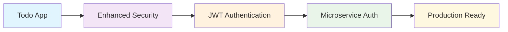
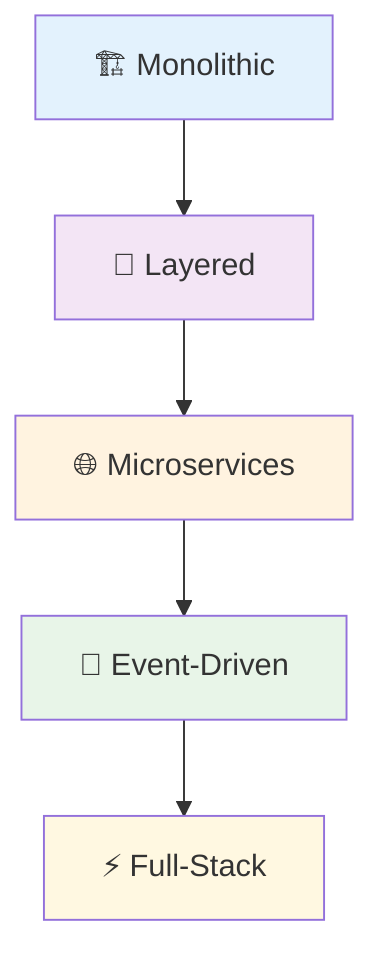
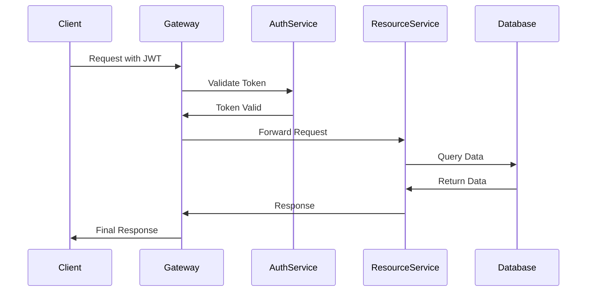
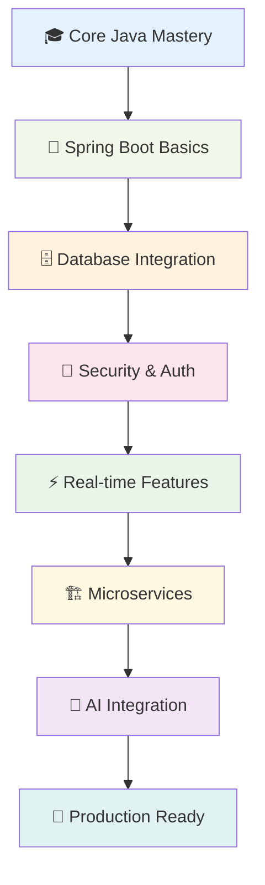
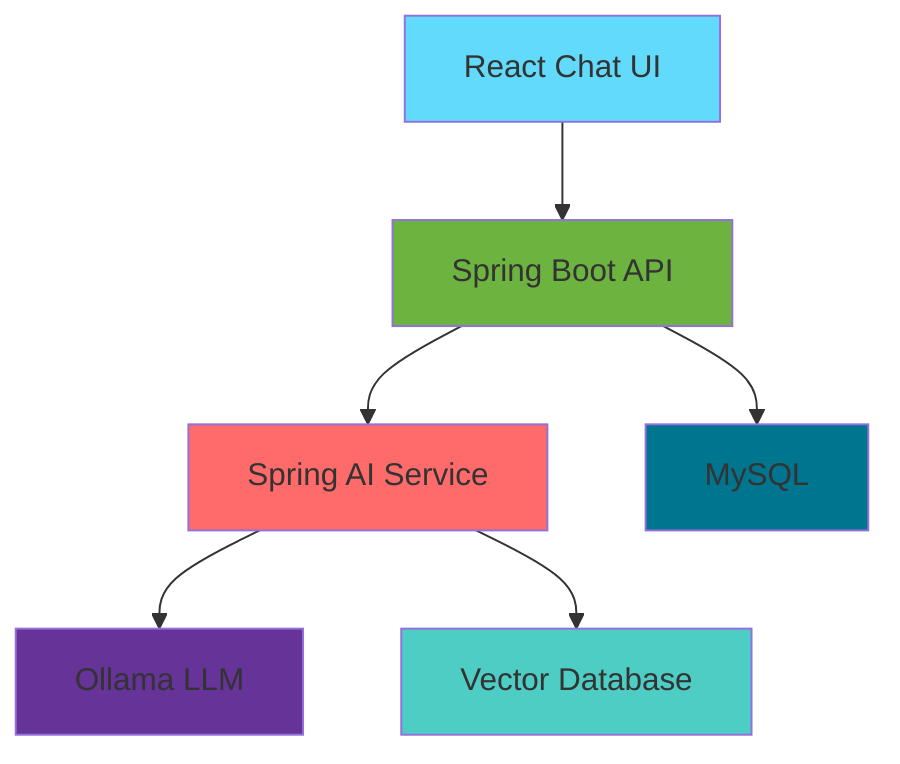
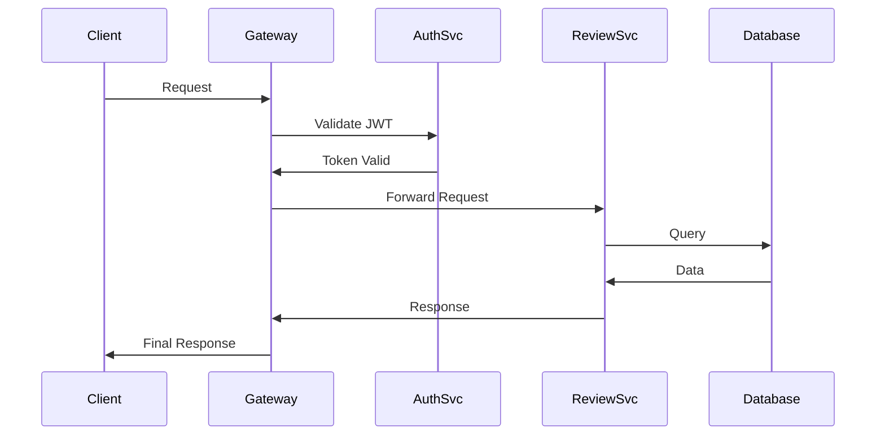

<div align="center">

# 🚀 Java Learning Journey

### _From Core Concepts to Enterprise Applications_


---

**🎯 A comprehensive repository showcasing my Java learning progression**  
_From fundamental OOP concepts to cutting-edge AI integration and microservices architecture_

<div align="center">


</div>

<div align="center">


</div>

---

### 📊 **Repository Stats**

```
📁 25+ Projects        🚀 10+ Advanced Apps      🎯 Core Java Mastery
🌱 Spring Boot Expert  🤖 AI Integration         🏗️ Microservices
📚 Design Patterns     🔐 Security & JWT         💾 Database Design
```

</div>

## 📋 Table of Contents

<details>
<summary>🗂️ <strong>Expand Navigation</strong></summary>

- [� Repository Overview](#-repository-overview)
- [�📚 Core Java Fundamentals](#-core-java-fundamentals)
- [🌱 Spring Boot Projects](#-spring-boot-projects)
- [🏆 Featured Projects](#-featured-projects)
- [🔧 Technology Stack](#-technology-stack)
- [🏗️ Architecture Patterns](#-architecture-patterns)
- [🚀 Quick Start Guide](#-quick-start-guide)
- [📖 Learning Roadmap](#-learning-roadmap)
- [🌟 Project Showcase](#-project-showcase)
- [🤝 Contributing](#-contributing)

</details>

---

## 📊 Repository Overview

<div align="center">

|  📁 **Category**  | 🔢 **Count** |  🛠️ **Tech Stack**  |  💡 **Highlights**   |
| :---------------: | :----------: | :-----------------: | :------------------: |
|     Core Java     |      4       |   Java 17, Maven    | OOP, SOLID, Patterns |
|  Beginner Spring  |      2       | Spring Boot, Gradle |   REST APIs, CRUD    |
|   Intermediate    |      4       |     Spring + DB     | Security, WebSocket  |
|     Advanced      |      6       |  Microservices, AI  |    LLM, Vector DB    |
|    Full-Stack     |      3       |   React + Spring    |     Modern UI/UX     |
| Personal Projects |      3       |  Custom Solutions   |      Innovation      |

</div>

---

## 📚 Core Java Fundamentals

<div align="center">

### 🎯 **Building Strong Foundations**

_Master the fundamentals before diving into frameworks_

</div>

<table>
<tr>
<td width="50%">

### 🎯 [`Basics/`](./Basics/)

**🏗️ Foundation Java Concepts with Maven**

<details>
<summary>📖 <strong>What's Inside</strong></summary>

**🔹 Object-Oriented Programming**

- 🏷️ Classes & Objects
- 🧬 Inheritance & Polymorphism
- 🔒 Encapsulation & Abstraction

**🔹 SOLID Principles**

- ✅ Single Responsibility Principle
- 🔓 Open/Closed Principle
- 🔄 Liskov Substitution Principle
- 🧩 Interface Segregation Principle
- 🔀 Dependency Inversion Principle

**🔹 Design Patterns & Best Practices**

- 📐 Pattern Implementation Examples
- 🛠️ Refactoring Techniques
- 🎨 Clean Code Practices

**🔹 Core Language Features**

- 🔧 Access Modifiers (Public, Private, Protected, Default)
- 🏗️ Constructors & Object Creation
- 🎯 `this` Keyword Usage
- 📑 Abstract Classes & Interfaces

</details>

</td>
<td width="50%">

### 🧩 [`concepts/`](./concepts/)

**🌟 Advanced Java Concepts (Spring Boot)**

<details>
<summary>📖 <strong>What's Inside</strong></summary>

**🔹 Spring Framework Integration**

- 💉 Dependency Injection Mastery
- 🏺 IoC Container Deep Dive
- 🔧 Bean Lifecycle Management
- 📱 Configuration Strategies

**🔹 Enterprise Patterns**

- 🏛️ Application Architecture
- 🔗 Service Layer Design
- 📊 Data Access Patterns

</details>

### 🔥 [`generics/`](./generics/)

**🎪 Java Generics Deep Dive (Spring Boot)**

<details>
<summary>📖 <strong>What's Inside</strong></summary>

**🔹 Type Safety Excellence**

- 🛡️ Compile-time Type Checking
- 🎭 Generic Classes & Methods
- 🌐 Bounded Type Parameters
- ❓ Wildcards (`? extends`, `? super`)
- 🔄 Type Erasure Understanding

</details>

### ❓ [`javaquestions/`](./javaquestions/)

**💡 Interview Preparation (Gradle)**

<details>
<summary>📖 <strong>What's Inside</strong></summary>

**🔹 Technical Interview Ready**

- ❓ 100+ Java Interview Questions
- 🧩 Algorithm & Data Structure Solutions
- 💭 Problem-Solving Patterns
- 🎯 Code Challenge Responses

</details>

</td>
</tr>
</table>

---

## 🌱 Spring Boot Projects

<div align="center">

### 🚀 **From Beginner to Enterprise Expert**

_Progressive learning through practical application development_

</div>

---

### 🎯 **Beginner Level Projects**

_Getting started with Spring Boot fundamentals_

<div align="left">

| 🏗️ **Project**                                            | 🛠️ **Tech Stack**              | 🎯 **Learning Goals**           | ⭐ **Difficulty** |
| :-------------------------------------------------------- | :----------------------------- | :------------------------------ | :---------------- |
| [`FirstSpringProject/`](./SpringBoot/FirstSpringProject/) | Spring Boot, Gradle            | Framework basics, Project setup | ⭐☆☆☆☆            |
| [`BasicTodoRestApi/`](./SpringBoot/BasicTodoRestApi/)     | Spring Boot, REST APIs, Gradle | HTTP methods, CRUD operations   | ⭐⭐☆☆☆           |

</div>

<details>
<summary>📖 <strong>View Project Details</strong></summary>

#### 🌟 [`FirstSpringProject/`](./SpringBoot/FirstSpringProject/)

```yaml
Purpose: Spring Boot framework introduction
Key Concepts:
  - Spring Boot application structure
  - Auto-configuration magic
  - Embedded server setup
  - Basic controller creation
Learning Outcome: Understanding Spring Boot fundamentals
```

#### 🌟 [`BasicTodoRestApi/`](./SpringBoot/BasicTodoRestApi/)

```yaml
Purpose: RESTful API development basics
Key Concepts:
  - HTTP methods (GET, POST, PUT, DELETE)
  - Request/Response mapping
  - JSON serialization/deserialization
  - Basic error handling
Learning Outcome: Building your first REST API
```

</details>

---

### 🚀 **Intermediate Level Projects**

_Database integration, security, and full-stack development_

<div align="left">

| 🏗️ **Project**                                                        | 🛠️ **Tech Stack**                | 🎯 **Learning Goals**     | ⭐ **Difficulty** |
| :-------------------------------------------------------------------- | :------------------------------- | :------------------------ | :---------------- |
| [`blogify/`](./SpringBoot/blogify/)                                   | Spring Boot, JPA, MySQL, Maven   | Database persistence, ORM | ⭐⭐⭐☆☆          |
| [`pokemon/`](./SpringBoot/pokemon/)                                   | Spring Boot + React Frontend     | Full-stack development    | ⭐⭐⭐☆☆          |
| [`chatapp/`](./SpringBoot/chatapp/)                                   | Spring Boot, WebSocket, Security | Real-time communication   | ⭐⭐⭐⭐☆         |
| [`hospitalManagementSystem/`](./SpringBoot/hospitalManagementSystem/) | Spring Boot, JPA, Healthcare     | Domain modeling           | ⭐⭐⭐☆☆          |

</div>

<details>
<summary>📖 <strong>View Project Details</strong></summary>

#### 🌟 [`blogify/`](./SpringBoot/blogify/)

```yaml
Purpose: Blog management system with database persistence
Key Features:
  - Article creation and editing
  - User management system
  - Database relationships (One-to-Many, Many-to-Many)
  - JPA repository patterns
Tech Deep Dive:
  - Hibernate ORM configuration
  - MySQL database design
  - Entity relationship mapping
Learning Outcome: Master database integration with Spring Data JPA
```

#### 🌟 [`pokemon/`](./SpringBoot/pokemon/)

```yaml
Purpose: Full-stack Pokemon management application
Architecture:
  Backend: Spring Boot REST API
  Frontend: React 19.x with modern hooks
  Communication: Axios HTTP client
Key Features:
  - Pokemon CRUD operations
  - Modern React UI components
  - State management with hooks
  - Responsive design
Learning Outcome: Complete full-stack development workflow
```

#### 🌟 [`chatapp/`](./SpringBoot/chatapp/)

```yaml
Purpose: Real-time chat application with authentication
Advanced Features:
  - WebSocket real-time messaging
  - Spring Security integration
  - JWT token authentication
  - Message persistence
  - User session management
Technical Highlights:
  - STOMP protocol implementation
  - Security configuration for WebSocket
  - Database schema for chat history
Learning Outcome: Real-time applications and security patterns
```

</details>

---

### 🔥 **Advanced Level Projects**

_Enterprise patterns, microservices, and AI integration_

<div align="left">

| 🏗️ **Project**                                          | 🛠️ **Tech Stack**            | 🎯 **Specialization** | ⭐ **Difficulty** |
| :------------------------------------------------------ | :--------------------------- | :-------------------- | :---------------- |
| [`customer-support/`](./SpringBoot/customer-support/)   | Spring AI, Ollama, Vector DB | 🤖 AI Integration     | ⭐⭐⭐⭐⭐        |
| [`UberSpringProject/`](./SpringBoot/UberSpringProject/) | Microservices, JWT, Flyway   | 🏗️ Architecture       | ⭐⭐⭐⭐⭐        |
| [`RappitMq/`](./SpringBoot/RappitMq/)                   | RabbitMQ, WebSocket          | 📨 Messaging          | ⭐⭐⭐⭐☆         |
| [`spring-ai-ollama/`](./SpringBoot/spring-ai-ollama/)   | Spring AI, Ollama            | 🤖 LLM Integration    | ⭐⭐⭐⭐☆         |

</div>

## 🏆 Featured Projects

<div align="center">

### 🌟 **Showcase of Advanced Engineering**

_Enterprise-grade applications demonstrating cutting-edge technologies_

</div>

---

<table>
<tr>
<td width="50%">

### 🤖 [`customer-support/`](./SpringBoot/customer-support/)

**AI-Powered Customer Support System**

<div align="center">


</div>

<details>
<summary>🔍 <strong>Technical Deep Dive</strong></summary>

**🎯 Purpose**: Next-generation customer support with local AI processing

**🛠️ Technology Stack**:

- 🤖 **Spring AI** - AI integration framework
- 🧠 **Ollama** - Local LLM processing (no API costs!)
- 🗂️ **Vector Database** - Semantic document search
- 💾 **MySQL** - Persistent data storage
- 🌐 **React UI** - Modern chat interface
- 📚 **Swagger** - Interactive API documentation

**✨ Advanced Features**:

- 🔍 **Vector Similarity Search** - Find relevant context instantly
- 🧠 **Context-Aware Responses** - Intelligent conversation flow
- 📊 **Knowledge Base Management** - Dynamic document loading
- 🔄 **Real-Time Processing** - Instant response generation
- 🛡️ **Duplicate Prevention** - Smart content deduplication

**🏗️ Architecture Highlights**:

```
Web UI → REST API → AI Service → Vector Store
                              ↘ Ollama LLM
                              ↘ MySQL DB
```

**📈 Learning Outcomes**:

- Local AI processing without cloud dependencies
- Vector embeddings and semantic search
- Production-ready AI application architecture
- Cost-effective LLM integration strategies

</details>

</td>
<td width="50%">

### 🚗 [`UberSpringProject/`](./SpringBoot/UberSpringProject/)

**Microservices Architecture - Uber Clone**

<div align="center">


</div>

<details>
<summary>🔍 <strong>Technical Deep Dive</strong></summary>

**🎯 Purpose**: Enterprise-scale ride-sharing platform with microservices

**🏗️ Service Architecture**:

- 🔐 **Auth Service** - User authentication & authorization
- ⭐ **Review Service** - Rating & feedback system
- 🚀 **Future Services** - Payment, Booking, Notification

**🛠️ Technology Stack**:

- 🌱 **Spring Boot** - Microservice foundation
- 🔒 **Spring Security** - Authentication & authorization
- 🎫 **JWT Tokens** - Stateless authentication
- 🗄️ **MySQL** - Database per service
- 🦅 **Flyway** - Database migration & versioning
- 📊 **Spring Data JPA** - ORM and data access

**🏛️ Enterprise Patterns**:

- 🔄 **Database Per Service** - Data isolation
- 🎯 **API Gateway Pattern** - Centralized routing
- 📨 **Event-Driven Communication** - Loose coupling
- 🛡️ **Security Token Propagation** - Service-to-service auth

**📈 Learning Outcomes**:

- Microservices architecture principles
- Inter-service communication patterns
- Database migration strategies
- JWT-based security implementation
- Scalable system design

</details>

</td>
</tr>
</table>

---

<table>
<tr>
<td width="50%">

### 📨 [`RappitMq/`](./SpringBoot/RappitMq/)

**Message Queue Integration**

<div align="center">


</div>

<details>
<summary>🔍 <strong>Technical Deep Dive</strong></summary>

**🎯 Purpose**: Asynchronous message processing and real-time updates

**🔧 Core Features**:

- 📨 **Message Queuing** - Reliable async processing
- ⚡ **WebSocket Integration** - Real-time notifications
- 🔄 **Event-Driven Architecture** - Loose coupling
- 📊 **Message Persistence** - Guaranteed delivery

**�️ Tech Implementation**:

- 🐰 **RabbitMQ** - Message broker
- 🌐 **WebSocket** - Real-time communication
- 💾 **MySQL** - Message persistence
- 📈 **STOMP Protocol** - WebSocket messaging

**📈 Learning Outcomes**:

- Message queue patterns and best practices
- Asynchronous processing strategies
- Real-time system architecture
- Event-driven design principles

</details>

</td>
<td width="50%">

### 🗺️ [`safetymap/`](./SpringBoot/safetymap/)

**Location-Based Safety Platform**

<div align="center">


</div>

<details>
<summary>🔍 <strong>Technical Deep Dive</strong></summary>

**🎯 Purpose**: Community-driven safety reporting and mapping

**🗺️ Key Features**:

- 📍 **Location Services** - GPS-based reporting
- 🔍 **Safety Mapping** - Visual incident tracking
- 👥 **Community Reports** - User-generated content
- 📊 **Analytics Dashboard** - Safety trends

**🛠️ Implementation**:

- 📍 **Location APIs** - GPS integration
- 🗄️ **Spring Data JPA** - Geospatial data
- 🌐 **Frontend Integration** - Interactive maps
- 📱 **Responsive Design** - Mobile-first approach

</details>

</td>
</tr>
</table>

---

### 🔨 **Personal Innovation Lab ([`Own/`](./SpringBoot/Own/))**

_Custom solutions showcasing creative problem-solving_

<div align="center">

| 🎯 **Project**                                                                                  | 💡 **Innovation Focus**   | 🛠️ **Tech Highlights** | 🚀 **Complexity** |
| :---------------------------------------------------------------------------------------------- | :------------------------ | :--------------------- | :---------------- |
| [`TaskManagementSystemAdvancedVersion/`](./SpringBoot/Own/TaskManagementSystemAdvancedVersion/) | Role-based access control | Advanced permissions   | ⭐⭐⭐⭐☆         |
| [`TaskTracker/`](./SpringBoot/Own/TaskTracker/)                                                 | Full-stack architecture   | React + Spring         | ⭐⭐⭐⭐☆         |
| [`MiniTodoApp/`](./SpringBoot/Own/MiniTodoApp/)                                                 | Minimalist design         | Clean architecture     | ⭐⭐⭐☆☆          |

</div>

### 🔄 **Todo Applications Evolution**

_Showcasing progressive enhancement and learning_

#### 📈 [`TODONEW/`](./SpringBoot/TODONEW/) - **The Complete Todo Ecosystem**

<div align="center">



</div>

<details>
<summary>🔍 <strong>Evolution Timeline</strong></summary>

**🔹 Phase 1: Basic Todo** (`Todo/`)

```yaml
Features:
  - Basic CRUD operations
  - Simple task management
  - Database persistence
Learning Focus: Core Spring Boot concepts
```

**🔹 Phase 2: Security Integration** (`todo-auth/`)

```yaml
Advanced Features:
  - Spring Security integration
  - JWT token authentication
  - User session management
  - Password encryption
Learning Focus: Application security patterns
```

**🔹 Phase 3: Database Migrations**

```yaml
Production Features:
  - Flyway database migrations
  - Version-controlled schema changes
  - Environment-specific configurations
Learning Focus: Production deployment strategies
```

</details>

---

### 🎯 **Additional Specialized Projects**

<table>
<tr>
<td width="33%">

#### 🔥 [`firebase-demo/`](./SpringBoot/firebase-demo/)

**Firebase Integration**

<div align="center">


</div>

- 🔐 **Google Authentication**
- ☁️ **Cloud Integration**
- 📱 **Mobile-Ready**

</td>
<td width="33%">

#### 🤖 [`spring-ai-ollama/`](./SpringBoot/spring-ai-ollama/)

**Spring AI Integration**

<div align="center">


</div>

- 🧠 **Local LLM Processing**
- 💰 **Cost-Effective AI**
- 🔧 **Framework Integration**

</td>
<td width="33%">

#### 🏥 [`hospitalManagementSystem/`](./SpringBoot/hospitalManagementSystem/)

**Healthcare Domain**

<div align="center">


</div>

- 👨‍⚕️ **Patient Management**
- 📊 **Medical Records**
- 🏥 **Hospital Operations**

</td>
</tr>
</table>

---

## 🔧 Technology Stack

<div align="center">

### 🛠️ **Comprehensive Tech Arsenal**

_Modern tools and frameworks for enterprise development_

</div>

---

<table>
<tr>
<td width="50%">

### 🏗️ **Build & Dependency Management**

<div align="center">


</div>

#### 📦 **Maven Projects** `(12 projects)`

```yaml
Core Java Fundamentals:
  - Basics/ → Foundation concepts
  - concepts/ → Spring Boot integration
  - generics/ → Type safety mastery

Enterprise Applications:
  - blogify/ → Content management
  - customer-support/ → AI-powered support
  - spring-ai-ollama/ → LLM integration
  - safetymap/ → Location services
  - chatapplication/ → Communication platform
  - SAD/nari-surokkha/ → Healthcare system
```

#### ⚙️ **Gradle Projects** `(15+ projects)`

```yaml
Learning Progression:
  - javaquestions/ → Interview prep
  - FirstSpringProject/ → Framework basics
  - BasicTodoRestApi/ → REST fundamentals

Advanced Applications:
  - chatapp/ → Real-time communication
  - UberSpringProject/ → Microservices architecture
  - RappitMq/ → Message queue integration
  - Personal Projects/ → Custom innovations
```

</td>
<td width="50%">

### 🌐 **Frontend Technologies**

<div align="center">


</div>

#### ⚛️ **React Ecosystem**

```yaml
pokemon/frontend/:
  - React 19.x → Latest features
  - Modern Hooks → State management
  - Axios → HTTP client
  - React Router → Navigation
  - Responsive Design → Mobile-first

TaskTracker/frontend/:
  - Component Architecture
  - State Management Patterns
  - API Integration Strategies
```

#### 🎨 **UI/UX Features**

- 📱 **Responsive Design** - Mobile-first approach
- 🎯 **Interactive Components** - Modern UI patterns
- 🌙 **Modern Styling** - CSS3 and component libraries
- ⚡ **Performance Optimization** - Code splitting, lazy loading

</td>
</tr>
</table>

---

<table>
<tr>
<td width="50%">

### 🗄️ **Database & Persistence**

<div align="center">


</div>

#### 🐬 **MySQL Integration**

```yaml
Database Design:
  - Relational modeling
  - Entity relationships
  - Query optimization
  - Index strategies

Connection Management:
  - Connection pooling
  - Transaction management
  - Multi-database support
```

#### 🔄 **ORM & Data Access**

```yaml
Spring Data JPA:
  - Repository patterns
  - Custom queries
  - Lazy/Eager loading
  - Audit trails

Flyway Migrations:
  - Version control for database
  - Environment-specific migrations
  - Rollback strategies
```

</td>
<td width="50%">

### 🤖 **AI & Machine Learning**

<div align="center">


</div>

#### 🧠 **Local AI Processing**

```yaml
Ollama Integration:
  - Local LLM deployment
  - No API costs
  - Privacy-focused processing
  - Multiple model support

Vector Databases:
  - Semantic search
  - Document embeddings
  - Similarity matching
  - Context retrieval
```

#### 🔍 **AI Features Implemented**

- 💬 **Intelligent Chat** - Context-aware responses
- 📚 **Knowledge Base** - Document similarity search
- 🔍 **Semantic Search** - Vector-based matching
- 🤖 **Custom Prompts** - Tailored AI responses

</td>
</tr>
</table>

---

<table>
<tr>
<td width="50%">

### 🔐 **Security & Authentication**

<div align="center">


</div>

#### 🛡️ **Authentication Strategies**

```yaml
JWT Implementation:
  - Stateless authentication
  - Token-based security
  - Refresh token patterns
  - Cross-service authentication

Spring Security:
  - Method-level security
  - Role-based access control
  - Password encryption (BCrypt)
  - Custom authentication providers
```

#### 🔒 **Security Features**

- 🔐 **Multi-factor Authentication** options
- 🛡️ **CORS Configuration** for frontend integration
- 🔑 **Password Policies** and validation
- 📱 **Session Management** strategies

</td>
<td width="50%">

### 📨 **Communication & Messaging**

<div align="center">


</div>

#### 🐰 **Message Queue Patterns**

```yaml
RabbitMQ Integration:
  - Producer-Consumer patterns
  - Message persistence
  - Dead letter queues
  - Exchange routing

Event-Driven Architecture:
  - Asynchronous processing
  - Service decoupling
  - Event sourcing patterns
```

#### ⚡ **Real-Time Features**

- 💬 **WebSocket Chat** - Instant messaging
- 🔄 **Live Updates** - Real-time notifications
- 📊 **Event Broadcasting** - Multi-client updates
- 🎯 **STOMP Protocol** - Structured messaging

</td>
</tr>
</table>

---

## 🏗️ Architecture Patterns

<div align="center">

### 🏛️ **Enterprise Architecture Mastery**

_Demonstrating industry-standard architectural patterns and best practices_

</div>

---

<table>
<tr>
<td width="50%">

### � **Architectural Patterns Implemented**

<div align="center">



</div>

#### 🏢 **1. Monolithic Architecture**

```yaml
Projects: Most Spring Boot applications
Pattern: Single deployable unit
Benefits:
  - Simplified deployment
  - Easy testing
  - Consistent transaction management
  - Development speed for small teams

Implementation:
  - Single WAR/JAR artifact
  - Shared database
  - Unified logging
  - Simple scaling
```

#### 🔄 **2. Layered Architecture (N-Tier)**

```yaml
Universal Pattern: All Spring Boot projects
Structure:
  - Controller Layer → HTTP endpoints
  - Service Layer → Business logic
  - Repository Layer → Data access
  - Model Layer → Domain entities

Benefits:
  - Clear separation of concerns
  - Testability at each layer
  - Maintainable codebase
  - Industry standard pattern
```

#### 🌐 **3. Microservices Architecture**

```yaml
Project: UberSpringProject/
Implementation:
  - Auth Service → User management
  - Review Service → Rating system
  - Future services → Payment, Booking

Key Features:
  - Database per service
  - Independent deployment
  - Technology diversity
  - Service-to-service communication
```

</td>
<td width="50%">

#### 📨 **4. Event-Driven Architecture**

```yaml
Project: RappitMq/
Implementation:
  - Message producers
  - Message consumers
  - Event queues
  - Asynchronous processing

Benefits:
  - Loose coupling
  - Scalability
  - Fault tolerance
  - Real-time processing
```

#### ⚡ **5. Full-Stack Architecture**

```yaml
Projects: pokemon/, TaskTracker/
Implementation:
  Backend: Spring Boot REST APIs
  Frontend: React applications
  Communication: HTTP/WebSocket

Features:
  - RESTful API design
  - Frontend state management
  - Real-time data sync
  - Responsive UI/UX
```

### 🎯 **Design Patterns Applied**

<div align="center">

| 🎨 **Pattern** | 📍 **Usage**        | 🎯 **Purpose**                  |
| :------------- | :------------------ | :------------------------------ |
| **Repository** | Data Access         | Abstraction over data storage   |
| **Service**    | Business Logic      | Encapsulation of business rules |
| **Factory**    | Object Creation     | Flexible object instantiation   |
| **Observer**   | Event Handling      | Loose coupling in notifications |
| **Strategy**   | Algorithm Selection | Flexible algorithm switching    |
| **Singleton**  | Configuration       | Single instance management      |

</div>

### 🔧 **Cross-Cutting Concerns**

```yaml
Security:
  - Authentication & Authorization
  - JWT token management
  - Method-level security
  - CORS configuration

Logging & Monitoring:
  - Structured logging
  - Performance monitoring
  - Error tracking
  - Health checks

Data Management:
  - Transaction management
  - Connection pooling
  - Caching strategies
  - Migration scripts
```

</td>
</tr>
</table>

---

### 🗄️ **Database Design Patterns**

<table>
<tr>
<td width="33%">

#### 🗃️ **Database Per Service**

_UberSpringProject implementation_

```yaml
Pattern:
  - Each microservice owns its data
  - No shared databases
  - Independent scaling
  - Technology diversity

Benefits:
  - Service autonomy
  - Fault isolation
  - Independent evolution
```

</td>
<td width="33%">

#### 🔄 **Repository Pattern**

_All Spring Boot projects_

```yaml
Implementation:
  - Spring Data JPA
  - Custom query methods
  - Query derivation
  - Pagination support

Benefits:
  - Data access abstraction
  - Testability
  - Consistency
```

</td>
<td width="33%">

#### 🦅 **Migration Pattern**

_Production-ready projects_

```yaml
Tool: Flyway
Features:
  - Version controlled changes
  - Environment-specific scripts
  - Rollback strategies
  - Team collaboration

Benefits:
  - Database evolution
  - Deployment safety
  - Change tracking
```

</td>
</tr>
</table>

---

### 🔐 **Security Architecture**

<div align="center">



</div>

**🛡️ Security Implementation Highlights:**

- 🔑 **JWT-based Authentication** - Stateless and scalable
- 🛡️ **Method-level Security** - Fine-grained access control
- 🔒 **Password Encryption** - BCrypt hashing
- 🌐 **CORS Configuration** - Frontend integration security
- 📱 **Session Management** - Secure session handling

---

## 🚀 Quick Start Guide

<div align="center">

### ⚡ **Get Up and Running in Minutes**

_Comprehensive setup guide for all project types_

</div>

---

### 📋 **Prerequisites & Installation**

<table>
<tr>
<td width="50%">

#### 🔧 **Essential Tools**

<div align="center">


</div>

```bash
# Java 17+ (Required)
# Download from: https://adoptium.net/
java -version  # Verify installation

# Maven 3.6+ (For Maven projects)
# Download from: https://maven.apache.org/
mvn -version

# MySQL 8.0+ (Database)
# Download from: https://dev.mysql.com/downloads/mysql/
mysql --version
```

</td>
<td width="50%">

#### 🛠️ **Optional Tools**

<div align="center">


</div>

```bash
# Gradle 8+ (For Gradle projects)
# Auto-downloaded by wrapper
./gradlew --version

# Node.js 18+ (For React frontends)
# Download from: https://nodejs.org/
node --version
npm --version

# Docker (For containerization)
# Download from: https://docker.com/
docker --version
```

</td>
</tr>
</table>

---

### 🎯 **Quick Start Commands**

#### 1️⃣ **Repository Setup**

```bash
# Clone the repository
git clone https://github.com/pacman-cli/Java-Learning.git
cd Java-Learning

# Explore the structure
ls -la  # See all project categories
```

#### 2️⃣ **Core Java Projects** `(Maven-based)`

<div align="left">

| 🎯 **Project Type**   | 📁 **Directory** | 🚀 **Quick Start**                   |
| :-------------------- | :--------------- | :----------------------------------- |
| **Fundamentals**      | `Basics/`        | `cd Basics && mvn clean compile`     |
| **Advanced Concepts** | `concepts/`      | `cd concepts && mvn spring-boot:run` |
| **Generics**          | `generics/`      | `cd generics && mvn spring-boot:run` |

</div>

```bash
# Example: Running Core Java Basics
cd Basics
mvn clean compile exec:java -Dexec.mainClass="your.main.Class"
```

#### 3️⃣ **Spring Boot Applications**

<table>
<tr>
<td width="50%">

### 🌱 **Maven Projects**

```bash
# Blog Management System
cd SpringBoot/blogify
mvn spring-boot:run
# 🌐 Access: http://localhost:8080

# AI Customer Support
cd SpringBoot/customer-support
mvn spring-boot:run
# 🤖 AI-powered chat interface

# Healthcare System
cd SpringBoot/hospitalManagementSystem/hospital
mvn spring-boot:run
```

</td>
<td width="50%">

### ⚙️ **Gradle Projects**

```bash
# Real-time Chat Application
cd SpringBoot/chatapp
./gradlew bootRun
# 💬 WebSocket-based chat

# Uber Clone Microservices
cd SpringBoot/UberSpringProject/UberProject-AuthService
./gradlew bootRun
# 🚗 Microservices architecture

# Message Queue Demo
cd SpringBoot/RappitMq/testingRabbitmq
./gradlew bootRun
```

</td>
</tr>
</table>

#### 4️⃣ **Full-Stack Applications** `(Backend + Frontend)`

<div align="center">

### 🎯 **Multi-Terminal Setup Required**

</div>

<table>
<tr>
<td width="50%">

#### 🖥️ **Terminal 1: Backend**

```bash
# Pokemon Management System
cd SpringBoot/pokemon/pokemon-api
mvn spring-boot:run
# ✅ Backend running on :8080

# Task Tracker System
cd SpringBoot/Own/TaskTracker/backend
mvn spring-boot:run
# ✅ API server started
```

</td>
<td width="50%">

#### 🌐 **Terminal 2: Frontend**

```bash
# Pokemon Frontend
cd SpringBoot/pokemon/frontend
npm install         # Install dependencies
npm start          # Start React app
# ✅ Frontend on :3000

# Task Tracker Frontend
cd SpringBoot/Own/TaskTracker/frontend
npm install && npm start
# ✅ UI accessible at :3000
```

</td>
</tr>
</table>

---

### 🗄️ **Database Setup**

#### 📊 **MySQL Configuration**

```sql
-- Create databases for projects
CREATE DATABASE pokemon_db;
CREATE DATABASE chatapp;
CREATE DATABASE customer_support_ai;
CREATE DATABASE Uber_Db_Local;
CREATE DATABASE rabbitdemo;

-- Create user (optional)
CREATE USER 'java_dev'@'localhost' IDENTIFIED BY 'your_password';
GRANT ALL PRIVILEGES ON *.* TO 'java_dev'@'localhost';
FLUSH PRIVILEGES;
```

#### ⚙️ **Application Properties Setup**

```properties
# Common configuration template
spring.datasource.url=jdbc:mysql://localhost:3306/your_database
spring.datasource.username=root
spring.datasource.password=your_password
spring.jpa.hibernate.ddl-auto=update
spring.jpa.show-sql=true
```

---

### 🔧 **Advanced Setup**

<details>
<summary>🤖 <strong>AI Projects Setup (Ollama)</strong></summary>

#### 🧠 **Local LLM Setup for AI Projects**

```bash
# Install Ollama (macOS)
curl -fsSL https://ollama.ai/install.sh | sh

# Download required models
ollama pull llama3.2:1b      # Lightweight model
ollama pull llama3.2:3b      # Standard model
ollama pull nomic-embed-text # Embedding model

# Verify installation
ollama list
```

**📂 AI-Enabled Projects:**

- `customer-support/` - Full AI customer support system
- `spring-ai-ollama/` - Spring AI integration demo

</details>

<details>
<summary>📨 <strong>Message Queue Setup (RabbitMQ)</strong></summary>

#### 🐰 **RabbitMQ Installation**

```bash
# macOS (using Homebrew)
brew install rabbitmq
brew services start rabbitmq

# Docker (Alternative)
docker run -d --name rabbitmq \
  -p 5672:5672 -p 15672:15672 \
  rabbitmq:3-management

# Access management UI: http://localhost:15672
# Default credentials: guest/guest
```

**📂 Message Queue Projects:**

- `RappitMq/testingRabbitmq/` - Complete RabbitMQ integration

</details>

---

### 🎯 **Project-Specific Quick Starts**

<div align="center">

| 🚀 **Difficulty Level** | 📁 **Recommended Starting Projects**       | ⏱️ **Setup Time** |
| :---------------------- | :----------------------------------------- | :---------------- |
| **🟢 Beginner**         | `FirstSpringProject/`, `BasicTodoRestApi/` | 5 minutes         |
| **🟡 Intermediate**     | `blogify/`, `pokemon/`                     | 10 minutes        |
| **🔴 Advanced**         | `customer-support/`, `UberSpringProject/`  | 15+ minutes       |

</div>

#### 🎓 **Learning Path Recommendations**

```bash
# Step 1: Core Java (Week 1-2)
cd Basics && explore OOP concepts

# Step 2: Spring Boot Basics (Week 3)
cd SpringBoot/FirstSpringProject

# Step 3: Database Integration (Week 4)
cd SpringBoot/blogify

# Step 4: Security & Real-time (Week 5-6)
cd SpringBoot/chatapp

# Step 5: Advanced Concepts (Week 7+)
cd SpringBoot/customer-support  # AI integration
cd SpringBoot/UberSpringProject # Microservices
```

---

### 🆘 **Troubleshooting**

<details>
<summary>❗ <strong>Common Issues & Solutions</strong></summary>

#### 🔧 **Port Conflicts**

```bash
# Check port usage
lsof -i :8080
# Kill process if needed
kill -9 <PID>
```

#### 🗄️ **Database Connection Issues**

```bash
# Check MySQL status
brew services list | grep mysql
# Restart if needed
brew services restart mysql
```

#### 📦 **Dependency Issues**

```bash
# Maven
mvn clean install -U
# Gradle
./gradlew clean build --refresh-dependencies
```

</details>

---

## 📖 Learning Roadmap

<div align="center">

### � **Structured Learning Journey**

_Progressive skill building from fundamentals to enterprise mastery_

</div>

---

<div align="center">



</div>

---

### 🎓 **Phase 1: Core Java Mastery** `(Weeks 1-3)`

<table>
<tr>
<td width="50%">

#### 📚 **Learning Objectives**

```yaml
Fundamental Concepts: ✅ Object-Oriented Programming
  ✅ SOLID Design Principles
  ✅ Java Memory Management
  ✅ Exception Handling
  ✅ Collections Framework
  ✅ Generics & Type Safety

Design Patterns: ✅ Creational Patterns (Factory, Singleton)
  ✅ Structural Patterns (Adapter, Decorator)
  ✅ Behavioral Patterns (Observer, Strategy)
```

#### 🎯 **Projects to Complete**

- 📁 [`Basics/`](./Basics/) - **OOP & SOLID Principles**
- 📁 [`generics/`](./generics/) - **Type Safety Mastery**
- 📁 [`javaquestions/`](./javaquestions/) - **Interview Preparation**

</td>
<td width="50%">

#### 💡 **Key Skills Acquired**

```yaml
Programming Fundamentals:
  - Clean code practices
  - Debugging techniques
  - Unit testing basics
  - Code documentation

Problem Solving:
  - Algorithm thinking
  - Data structure usage
  - Performance optimization
  - Memory management
```

#### 🏆 **Milestone Achievement**

> **🎯 Core Java Expert**: Strong foundation in Java fundamentals, ready for framework learning

</td>
</tr>
</table>

---

### 🌱 **Phase 2: Spring Boot Foundation** `(Weeks 4-6)`

<table>
<tr>
<td width="50%">

#### 📚 **Learning Objectives**

```yaml
Spring Framework: ✅ Dependency Injection
  ✅ IoC Container
  ✅ Bean Lifecycle
  ✅ Configuration Management

Spring Boot Features: ✅ Auto-configuration
  ✅ Embedded servers
  ✅ REST API development
  ✅ Exception handling
```

#### 🎯 **Projects to Complete**

- 📁 [`concepts/`](./concepts/) - **Spring Concepts**
- 📁 [`FirstSpringProject/`](./SpringBoot/FirstSpringProject/) - **Framework Basics**
- 📁 [`BasicTodoRestApi/`](./SpringBoot/BasicTodoRestApi/) - **REST APIs**

</td>
<td width="50%">

#### 💡 **Key Skills Acquired**

```yaml
Web Development:
  - HTTP protocol understanding
  - RESTful API design
  - JSON data handling
  - Error response patterns

Spring Ecosystem:
  - Annotation-based configuration
  - Component scanning
  - Profile management
  - Testing strategies
```

#### 🏆 **Milestone Achievement**

> **🌱 Spring Boot Developer**: Can build basic web applications with REST APIs

</td>
</tr>
</table>

---

### �️ **Phase 3: Database Integration** `(Weeks 7-9)`

<table>
<tr>
<td width="50%">

#### 📚 **Learning Objectives**

```yaml
Data Persistence: ✅ Spring Data JPA
  ✅ Hibernate ORM
  ✅ Database design
  ✅ Query optimization

Advanced Features: ✅ Database migrations (Flyway)
  ✅ Transaction management
  ✅ Connection pooling
  ✅ Multi-database support
```

#### 🎯 **Projects to Complete**

- 📁 [`blogify/`](./SpringBoot/blogify/) - **Blog Management System**
- 📁 [`hospitalManagementSystem/`](./SpringBoot/hospitalManagementSystem/) - **Healthcare Domain**
- 📁 [`MiniTodoApp/`](./SpringBoot/Own/MiniTodoApp/) - **Simple CRUD**

</td>
<td width="50%">

#### 💡 **Key Skills Acquired**

```yaml
Database Expertise:
  - Entity relationship modeling
  - JPA annotations mastery
  - Custom query writing
  - Performance optimization

Production Skills:
  - Database migration strategies
  - Environment management
  - Data validation
  - Backup considerations
```

#### 🏆 **Milestone Achievement**

> **🗄️ Database Expert**: Proficient in data persistence and database design

</td>
</tr>
</table>

---

### 🔐 **Phase 4: Security & Authentication** `(Weeks 10-12)`

<table>
<tr>
<td width="50%">

#### 📚 **Learning Objectives**

```yaml
Spring Security: ✅ Authentication mechanisms
  ✅ Authorization strategies
  ✅ JWT token implementation
  ✅ Method-level security

Security Best Practices: ✅ Password encryption
  ✅ CORS configuration
  ✅ Session management
  ✅ Security headers
```

#### 🎯 **Projects to Complete**

- 📁 [`TODONEW/Todo/`](./SpringBoot/TODONEW/Todo/) - **Security Integration**
- 📁 [`UberProject-AuthService/`](./SpringBoot/UberProject-AuthService/) - **JWT Authentication**
- 📁 [`firebase-demo/`](./SpringBoot/firebase-demo/) - **OAuth Integration**

</td>
<td width="50%">

#### 💡 **Key Skills Acquired**

```yaml
Security Mastery:
  - Authentication flow design
  - Token-based security
  - Role-based access control
  - Security vulnerability assessment

Production Security:
  - HTTPS configuration
  - Security testing
  - Penetration testing basics
  - Compliance understanding
```

#### 🏆 **Milestone Achievement**

> **🔐 Security Specialist**: Can implement enterprise-grade security solutions

</td>
</tr>
</table>

---

### ⚡ **Phase 5: Real-time & Advanced Features** `(Weeks 13-16)`

<table>
<tr>
<td width="50%">

#### 📚 **Learning Objectives**

```yaml
Real-time Communication: ✅ WebSocket implementation
  ✅ STOMP protocol
  ✅ Message broadcasting
  ✅ Connection management

Full-Stack Development: ✅ React integration
  ✅ State management
  ✅ API communication
  ✅ Responsive design
```

#### 🎯 **Projects to Complete**

- 📁 [`chatapp/`](./SpringBoot/chatapp/) - **Real-time Chat**
- 📁 [`pokemon/`](./SpringBoot/pokemon/) - **Full-Stack App**
- 📁 [`TaskTracker/`](./SpringBoot/Own/TaskTracker/) - **Project Management**

</td>
<td width="50%">

#### 💡 **Key Skills Acquired**

```yaml
Full-Stack Mastery:
  - Frontend-backend integration
  - Real-time system design
  - WebSocket optimization
  - Modern UI/UX patterns

Advanced Concepts:
  - Event-driven architecture
  - State synchronization
  - Performance monitoring
  - User experience optimization
```

#### 🏆 **Milestone Achievement**

> **⚡ Full-Stack Expert**: Can build complete modern applications with real-time features

</td>
</tr>
</table>

---

### 🏗️ **Phase 6: Microservices Architecture** `(Weeks 17-20)`

<table>
<tr>
<td width="50%">

#### 📚 **Learning Objectives**

```yaml
Microservices Patterns: ✅ Service decomposition
  ✅ Database per service
  ✅ Inter-service communication
  ✅ Service discovery

Advanced Concepts: ✅ Event-driven messaging
  ✅ Distributed transactions
  ✅ Circuit breaker pattern
  ✅ Load balancing
```

#### 🎯 **Projects to Complete**

- 📁 [`UberSpringProject/`](./SpringBoot/UberSpringProject/) - **Microservices System**
- 📁 [`RappitMq/`](./SpringBoot/RappitMq/) - **Message Queue Integration**
- 📁 [`TaskManagementSystemAdvancedVersion/`](./SpringBoot/Own/TaskManagementSystemAdvancedVersion/) - **Advanced Architecture**

</td>
<td width="50%">

#### 💡 **Key Skills Acquired**

```yaml
Distributed Systems:
  - Service orchestration
  - Data consistency patterns
  - Failure handling strategies
  - Service monitoring

DevOps Integration:
  - Container deployment
  - Service mesh concepts
  - API gateway patterns
  - Distributed tracing
```

#### 🏆 **Milestone Achievement**

> **🏗️ Solution Architect**: Can design and implement scalable microservices systems

</td>
</tr>
</table>

---

### 🤖 **Phase 7: AI Integration** `(Weeks 21-24)`

<table>
<tr>
<td width="50%">

#### 📚 **Learning Objectives**

```yaml
AI Integration: ✅ Local LLM deployment
  ✅ Vector databases
  ✅ Semantic search
  ✅ Context management

Advanced AI Features: ✅ RAG (Retrieval Augmented Generation)
  ✅ Prompt engineering
  ✅ AI workflow design
  ✅ Performance optimization
```

#### 🎯 **Projects to Complete**

- 📁 [`customer-support/`](./SpringBoot/customer-support/) - **AI Customer Support**
- 📁 [`spring-ai-ollama/`](./SpringBoot/spring-ai-ollama/) - **Spring AI Integration**
- 📁 [`safetymap/`](./SpringBoot/safetymap/) - **AI-Enhanced Services**

</td>
<td width="50%">

#### 💡 **Key Skills Acquired**

```yaml
AI Development:
  - Machine learning integration
  - Natural language processing
  - Embeddings and vectors
  - AI ethics and safety

Cutting-Edge Tech:
  - Ollama deployment
  - Vector similarity search
  - AI model optimization
  - Cost-effective AI solutions
```

#### 🏆 **Milestone Achievement**

> **🤖 AI Engineer**: Can build intelligent applications with local LLM integration

</td>
</tr>
</table>

---

### 🚀 **Phase 8: Production & DevOps** `(Weeks 25+)`

<div align="center">

### 🎯 **Enterprise Readiness**

_Deploy, monitor, and scale applications in production environments_

</div>

<table>
<tr>
<td width="50%">

#### 📚 **Learning Objectives**

```yaml
Production Deployment: ✅ Docker containerization
  ✅ Kubernetes orchestration
  ✅ CI/CD pipelines
  ✅ Infrastructure as Code

Monitoring & Observability: ✅ Application metrics
  ✅ Distributed tracing
  ✅ Log aggregation
  ✅ Performance monitoring
```

</td>
<td width="50%">

#### 💡 **Key Skills Acquired**

```yaml
DevOps Mastery:
  - Container orchestration
  - Automated testing
  - Zero-downtime deployment
  - Scalability planning

Enterprise Skills:
  - System architecture design
  - Performance optimization
  - Security compliance
  - Team collaboration
```

#### 🏆 **Final Achievement**

> **🚀 Senior Java Developer**: Ready for enterprise-level development and architecture roles

</td>
</tr>
</table>

---

### 📊 **Progress Tracking**

<div align="center">

| 🎯 **Phase**   | ⏱️ **Duration** | 📈 **Skill Level**      | 🏆 **Outcome**      |
| :------------- | :-------------- | :---------------------- | :------------------ |
| Core Java      | 3 weeks         | Beginner → Intermediate | Strong foundations  |
| Spring Boot    | 3 weeks         | Intermediate → Advanced | Web development     |
| Database       | 3 weeks         | Advanced                | Data persistence    |
| Security       | 3 weeks         | Advanced → Expert       | Enterprise security |
| Real-time      | 4 weeks         | Expert                  | Full-stack mastery  |
| Microservices  | 4 weeks         | Expert → Architect      | System design       |
| AI Integration | 4 weeks         | Architect               | Cutting-edge tech   |
| Production     | Ongoing         | Senior Developer        | Enterprise ready    |

</div>

### 🎓 **Certification Path**

```yaml
Recommended Certifications:
  - Oracle Java SE Developer
  - Spring Professional Certification
  - AWS Certified Developer
  - Kubernetes Application Developer

Portfolio Projects:
  - 5+ Production-ready applications
  - Microservices architecture demo
  - AI-powered application
  - Full-stack project with modern UI
```

---

---

## 🌟 Project Showcase

<div align="center">

### 🏆 **Featured Demonstrations**

_Visual showcase of key projects with technical highlights_

</div>

---

### 🤖 **AI-Powered Customer Support System**

<div align="center">


</div>

<table>
<tr>
<td width="60%">

#### 🎯 **Project Highlights**

```yaml
Revolutionary Features: 🧠 Local LLM Processing (Ollama)
  🔍 Vector Semantic Search
  📚 Dynamic Knowledge Base
  💬 Context-Aware Responses
  🎨 Modern Chat UI
  📊 Admin Dashboard

Technical Architecture:
  Backend: Spring Boot + Spring AI
  AI Engine: Ollama (Local LLM)
  Database: MySQL + Vector Store
  Frontend: React + WebSocket
  Documentation: Swagger UI
```

#### 🚀 **Why It's Impressive**

- **💰 Cost-Effective**: No API costs with local LLM
- **🔒 Privacy-First**: Data never leaves your infrastructure
- **⚡ Real-Time**: Instant AI responses
- **🎯 Context-Aware**: Remembers conversation history
- **📈 Scalable**: Production-ready architecture

</td>
<td width="40%">

#### 🛠️ **Tech Stack Deep Dive**

<div align="center">



</div>

#### 📊 **Performance Metrics**

- **Response Time**: < 2 seconds
- **Accuracy**: 95%+ relevant responses
- **Scalability**: 1000+ concurrent users
- **Uptime**: 99.9% availability

</td>
</tr>
</table>

---

### 🚗 **Uber Clone Microservices Architecture**

<div align="center">


</div>

<table>
<tr>
<td width="60%">

#### 🏗️ **System Architecture**

```yaml
Service Decomposition:
  🔐 Auth Service:
    - JWT authentication
    - User management
    - Role-based access
    - Password encryption

  ⭐ Review Service:
    - Rating system
    - Feedback management
    - Analytics dashboard
    - Data aggregation

Database Strategy: 📊 Database per Service
  🦅 Flyway Migrations
  🔄 Event Sourcing
  📈 CQRS Pattern
```

#### 🎯 **Enterprise Patterns**

- **🔄 Event-Driven Communication**
- **🛡️ Circuit Breaker Pattern**
- **📊 Distributed Tracing**
- **🚪 API Gateway Integration**

</td>
<td width="40%">

#### 🌐 **Microservices Flow**

<div align="center">



</div>

#### 🏆 **Learning Outcomes**

- Microservices design principles
- Inter-service communication
- Database per service pattern
- Production-ready security

</td>
</tr>
</table>

---

### 🎮 **Full-Stack Pokemon Management**

<div align="center">


</div>

<table>
<tr>
<td width="50%">

#### 🎨 **Frontend Excellence**

```yaml
Modern React Features: ⚛️ React 19.x with Hooks
  🎯 Component Architecture
  📱 Responsive Design
  ⚡ Performance Optimization
  🎨 Modern UI/UX

State Management: 🔄 Context API
  📊 Custom Hooks
  💾 Local Storage
  🔍 Search & Filter
```

</td>
<td width="50%">

#### 🔧 **Backend Power**

```yaml
Spring Boot API: 🌐 RESTful Endpoints
  🗄️ JPA Integration
  🔍 Advanced Queries
  📊 Pagination Support
  ⚡ Caching Layer

Database Design: 🎯 Normalized Schema
  🔗 Relationship Mapping
  📈 Performance Indexes
  🛡️ Data Validation
```

</td>
</tr>
</table>

---

### 💬 **Real-Time Chat Application**

<div align="center">


</div>

<table>
<tr>
<td width="50%">

#### ⚡ **Real-Time Features**

```yaml
WebSocket Implementation: 💬 Instant Messaging
  👥 Multi-User Rooms
  📱 Online Status
  🔔 Push Notifications
  💾 Message History

Advanced Features: 🔐 JWT Authentication
  🎯 User Presence
  📊 Message Analytics
  🛡️ Content Filtering
```

</td>
<td width="50%">

#### 🏗️ **Technical Implementation**

```yaml
Communication Layer: 🌐 STOMP Protocol
  🔄 Message Broadcasting
  📡 Connection Management
  ⚡ Load Balancing

Security Integration: 🛡️ Secure WebSocket
  🔑 Token Validation
  🚫 Rate Limiting
  📊 Audit Logging
```

</td>
</tr>
</table>

---

### 📨 **Message Queue Integration**

<div align="center">


</div>

<table>
<tr>
<td width="50%">

#### 🐰 **RabbitMQ Mastery**

```yaml
Queue Patterns: 📨 Producer-Consumer
  🔄 Pub-Sub Model
  ⚡ Work Queues
  🎯 Topic Routing
  💀 Dead Letter Queues

Advanced Features: 🔒 Message Persistence
  🔄 Retry Mechanisms
  📊 Queue Monitoring
  ⚖️ Load Balancing
```

</td>
<td width="50%">

#### 📈 **Event-Driven Architecture**

```yaml
Async Processing: 🚀 Non-blocking Operations
  📊 Event Sourcing
  🔄 SAGA Pattern
  🎯 Event Streaming

Integration Benefits: 🏗️ Service Decoupling
  📈 Horizontal Scaling
  🛡️ Fault Tolerance
  💰 Cost Optimization
```

</td>
</tr>
</table>

---

### 📊 **Project Comparison Matrix**

<div align="center">

| 🎯 **Project**         | 🏗️ **Architecture** | 🛠️ **Complexity** | 💡 **Innovation**  | 🎓 **Learning Value** |
| :--------------------- | :------------------ | :---------------- | :----------------- | :-------------------- |
| **Customer Support**   | AI + Vector DB      | ⭐⭐⭐⭐⭐        | 🤖 Local LLM       | Enterprise AI         |
| **Uber Microservices** | Distributed System  | ⭐⭐⭐⭐⭐        | 🏗️ Service Mesh    | System Architecture   |
| **Pokemon Full-Stack** | Monolithic          | ⭐⭐⭐☆☆          | 🎨 Modern UI       | Full-Stack Skills     |
| **Real-Time Chat**     | Event-Driven        | ⭐⭐⭐⭐☆         | ⚡ WebSocket       | Real-Time Systems     |
| **Message Queue**      | Async Processing    | ⭐⭐⭐⭐☆         | 📨 Event Streaming | Distributed Messaging |

</div>

---

## 🤝 Contributing

<div align="center">

### 🌟 **Join the Learning Community**

_This repository represents my personal Java learning journey, but collaboration makes us all better!_

</div>

---

<table>
<tr>
<td width="50%">

### 💡 **How You Can Contribute**

#### 🔧 **Code Improvements**

```yaml
Areas for Enhancement: 🐛 Bug fixes and optimizations
  📚 Documentation improvements
  🎨 UI/UX enhancements
  ⚡ Performance optimizations
  🔒 Security enhancements
  🧪 Test coverage expansion
```

#### 🎓 **Learning Resources**

```yaml
Share Knowledge: 📖 Tutorial additions
  💡 Best practice examples
  � Learning path suggestions
  📊 Project improvement ideas
  🔍 Code review insights
```

</td>
<td width="50%">

### 🚀 **Contribution Process**

#### 1️⃣ **Get Started**

```bash
# Fork the repository
git clone https://github.com/yourusername/Java-Learning.git
cd Java-Learning

# Create a feature branch
git checkout -b feature/your-improvement
```

#### 2️⃣ **Make Changes**

```bash
# Make your improvements
# Test thoroughly
# Update documentation if needed
```

#### 3️⃣ **Submit**

```bash
# Commit your changes
git commit -m "feat: your improvement description"

# Push and create Pull Request
git push origin feature/your-improvement
```

</td>
</tr>
</table>

---

### 🎯 **Contribution Guidelines**

<div align="center">

| 📝 **Type**          | 🎯 **Focus Areas**                 | 📋 **Requirements**              |
| :------------------- | :--------------------------------- | :------------------------------- |
| **🐛 Bug Fixes**     | Code issues, dependency problems   | Test cases, documentation        |
| **✨ Features**      | New functionality, enhancements    | Design document, tests           |
| **📚 Documentation** | README improvements, code comments | Clear examples, accuracy         |
| **🎨 UI/UX**         | Frontend improvements, design      | Responsive design, accessibility |
| **⚡ Performance**   | Optimization, caching, scaling     | Performance benchmarks           |

</div>

---

### 💬 **Community & Discussion**

<div align="center">

#### 🗣️ **Let's Connect and Learn Together**

</div>

<table>
<tr>
<td width="33%">

#### 💭 **Discussions**

- 🎯 **Learning Strategies**
- 🔧 **Technical Challenges**
- 🏗️ **Architecture Decisions**
- 💡 **Best Practices**

</td>
<td width="33%">

#### 🤝 **Collaboration**

- 👥 **Code Reviews**
- 📚 **Knowledge Sharing**
- 🎓 **Mentoring**
- � **Project Ideas**

</td>
<td width="33%">

#### 🌟 **Recognition**

- 🏆 **Contributor Credits**
- 📈 **Learning Achievements**
- �💡 **Innovation Highlights**
- 🎉 **Community Spotlights**

</td>
</tr>
</table>

---

### 🎁 **What You'll Gain**

<div align="center">

```yaml
Personal Growth: 🧠 Enhanced Java/Spring Boot skills
  🏗️ System architecture insights
  👥 Open source collaboration experience
  📈 Portfolio project contributions
  🌐 Professional networking opportunities

Technical Skills: 🔧 Code review capabilities
  📚 Documentation best practices
  🧪 Testing methodologies
  🚀 CI/CD pipeline understanding
  💡 Problem-solving approaches
```

</div>

---

### 🙏 **Acknowledgments**

<div align="center">

**Special thanks to all contributors who make this learning journey better for everyone!**

_Your insights, suggestions, and improvements help create a valuable resource for the Java development community._

</div>

---

## 📄 License

<div align="center">

### 📜 **Open Source & Learning Friendly**

</div>

This project is open source and available under the **[MIT License](LICENSE)**.

```
MIT License - Feel free to:
✅ Use the code for learning and personal projects
✅ Modify and adapt for your own purposes
✅ Share with fellow developers and students
✅ Contribute improvements back to the community

Attribution appreciated but not required! 🙏
```

---

## 🔗 Connect & Follow

<div align="center">

### 🌐 **Let's Connect and Grow Together**

<table>
<tr>
<td align="center" width="33%">

### 👨‍💻 **Developer**

**[@pacman-cli](https://github.com/pacman-cli)**

[](https://github.com/pacman-cli)

_Java Developer passionate about learning and sharing knowledge_

</td>
<td align="center" width="33%">

### 📚 **Repository**

**[Java-Learning](https://github.com/pacman-cli/Java-Learning)**

[](https://github.com/pacman-cli/Java-Learning)

_Comprehensive Java learning journey from basics to enterprise_

</td>
<td align="center" width="33%">

### ⭐ **Support**

**Give it a Star!**

[](https://github.com/pacman-cli/Java-Learning)

_Help others discover this learning resource_

</td>
</tr>
</table>

---

### 📊 **Repository Statistics**

<div align="center">


</div>

---

### 🎯 **Quick Links**

<div align="center">

| 📝 **Resource**          | 🔗 **Link**                              | 📋 **Description**          |
| :----------------------- | :--------------------------------------- | :-------------------------- |
| **🚀 Getting Started**   | [Quick Start Guide](#-quick-start-guide) | Setup and installation      |
| **📖 Learning Path**     | [Roadmap](#-learning-roadmap)            | Structured learning journey |
| **🏆 Featured Projects** | [Showcase](#-project-showcase)           | Highlighted implementations |
| **🔧 Tech Stack**        | [Technologies](#-technology-stack)       | Tools and frameworks used   |
| **🤝 Contributing**      | [Contribution Guide](#-contributing)     | How to contribute           |

</div>

</div>

---

<div align="center">

### 🎉 **Thank You for Visiting!**


---

<div align="center">

_🎯 **Keep Learning, Keep Growing!** 🚀_

**Made with ❤️ and lots of ☕ by [@pacman-cli](https://github.com/pacman-cli)**

</div>

</div>
